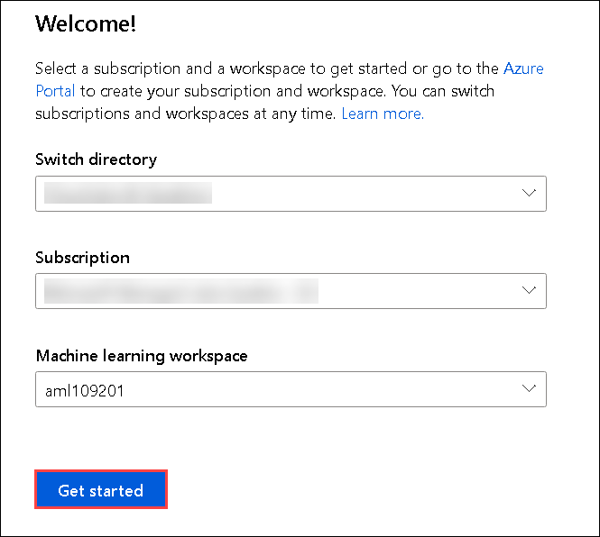
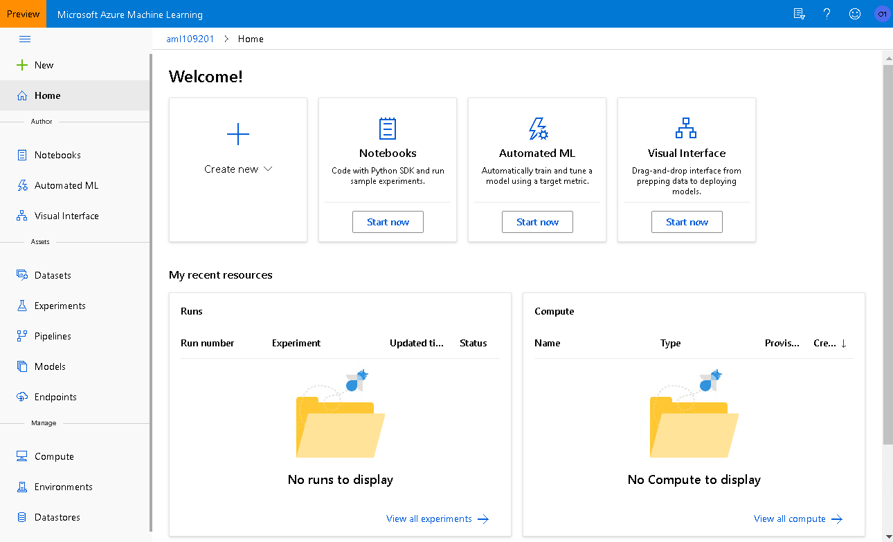

## **Getting Started**

### **Sign in to the Azure Machine Learning Studio**

1.Sign in to the **Azure Machine Learning studio** by navigating to https://ml.azure.com/ in your browser.

2.Use **<inject key="AzureAdUserEmail"></inject>** as **Username** and click on **Next**. 

3.In next step, use **<inject key="AzureAdUserPassword"></inject>** as **Password**  and Click **Sign In**.

4.On Stay signed in pop-up window, click **No**.

5.Now on the **Welcome** page. Leave the directory as default, select your **Subscription** and **AML Workspace** and click on **Get Started**.

 

6.Then close the **Welcome to Azure Machine Learning** block.

7.Now you are on the hoempage of Azure Machine Learning portal.

 

8.Click **Next** on the bottom right of this page.

 
