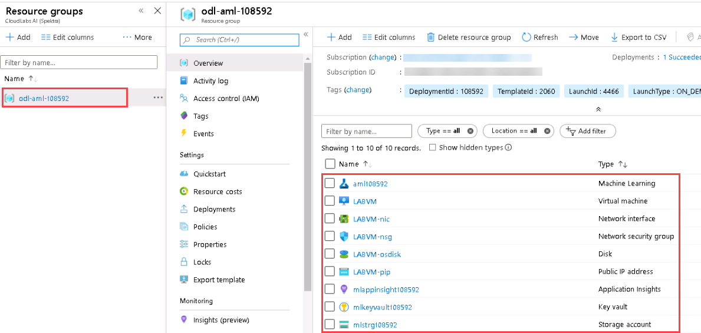

## **Getting Started**

### **Sign in to the Azure portal**

1.Launch Azure Portal(https://portal.azure.com) in the desktop on left side. You can use the shortcut on the desktop. You'd be asked to choose default browser configurations, You can skip those for now by clicking cancel. 

2.Use **<inject key="AzureAdUserEmail"></inject>** as **Username** and click on **Next**.  Please use right click > **copy** to copy the username and paste inside the browser. You should allow **clipboard access** when asked by the browser. 

3.In next step, use **<inject key="AzureAdUserPassword"></inject>** as **Password**  and Click **Sign In**

4.On Stay signed in pop-up window, click **No**.

   
   
5.You may encounter a popup entitled **Welcome to Microsoft Azure** with buttons for **Start Tour** and **Maybe Later** - Choose **Maybe Later**.

   

6.Click on **Resource Groups** icon in the portal.

   
   
7.Then select RG **odl-aml-xxx** to review the pre-created resource groups for you to use in the lab. 
   
   

8.Click **Next** on the bottom right of this page.

